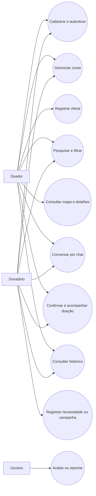

# Especificações do Projeto

Pré-requisitos: <a href="01-Documentação de Contexto.md"> Documentação de Contexto</a>

Esta especificação apresenta os perfis atendidos pelo Bem Próximo, suas histórias de usuário, os processos de doação, os requisitos funcionais e não funcionais e as restrições conhecidas. As informações foram organizadas a partir da documentação de contexto, da especificação, dos fluxos de interface e da metodologia do projeto.

## Personas

O projeto de origem define quatro perfis de usuários. Como não foram fornecidos nomes, idades ou dados comportamentais individuais, os perfis são mantidos sem a criação de características fictícias.

| Perfil | Descrição | Necessidades |
|--------|-----------|-------------|
| Pessoa física doadora (CPF) | Cidadão que deseja realizar doações. | Ajudar pessoas necessitadas, destinar itens excedentes e, quando aplicável, buscar dedução no Imposto de Renda. |
| Empresa doadora (CNPJ) | Instituição com fins lucrativos interessada em ações de doação. | Ajudar quem precisa, realizar ações voluntárias, fortalecer a imagem pública e, quando aplicável, buscar dedução no Imposto de Renda. |
| ONG ou instituição religiosa (CNPJ) | Instituição sem fins lucrativos, organização governamental ou grupo religioso. | Apoiar pessoas necessitadas e fortalecer o bem-estar da comunidade. |
| Pessoa física donatária (CPF) | Cidadão em situação de necessidade ou vulnerabilidade. | Receber itens que contribuam para a melhoria de sua qualidade de vida. |

## Histórias de Usuários

| EU COMO... `PERSONA` | QUERO/PRECISO... `FUNCIONALIDADE` | PARA... `MOTIVO/VALOR` |
|----------------------|-----------------------------------|------------------------|
| Donatário — instituição religiosa (CNPJ) | Criar uma campanha de arrecadação de agasalhos, informando quais itens são necessários, quantidades, tamanhos aceitos, prazo da campanha e local ou forma de entrega. | Divulgar uma necessidade específica à comunidade, acompanhar o que já foi arrecadado e evitar receber itens em excesso ou que não atendam à campanha. |
| Donatário — ONG (CNPJ) | Cadastrar uma lista atualizada de itens necessários, indicando prioridade, quantidade e se a necessidade é pontual ou recorrente. | Permitir que potenciais doadores saibam exatamente do que a instituição precisa naquele momento e direcionem suas doações de forma mais eficiente. |
| Donatário — ONG ou instituição religiosa (CNPJ) | Disponibilizar para outras instituições itens recebidos em quantidade superior à minha necessidade. | Evitar que doações fiquem paradas ou sejam desperdiçadas e permitir que outra instituição que esteja precisando desses itens possa utilizá-los. |
| Doador (CPF) | Informar quais itens tenho disponíveis para doação e encontrar instituições próximas que estejam precisando especificamente desses itens. | Destinar objetos em bom estado para quem realmente necessita, sem precisar procurar individualmente instituições e entrar em contato com cada uma delas. |
| Doador (CNPJ) | Cadastrar lotes de produtos excedentes ou próximos da retirada de estoque e identificar instituições interessadas em recebê-los. | Evitar desperdício, liberar espaço de armazenamento e direcionar produtos utilizáveis para organizações que possam aproveitá-los. |
| Doador ou donatário | Poder entrar em contato com a outra parte interessada na doação. | Combinar informações necessárias para sua realização, como disponibilidade, retirada e entrega dos itens. |
| Doador ou donatário | Acompanhar minhas doações e solicitações e consultar as que já foram concluídas. | Saber a situação das negociações atuais e manter um registro das doações que realizei ou recebi. |
| Usuário do aplicativo | Reportar uma solicitação ou oferta que considere suspeita, inadequada ou irregular. | Contribuir para que conteúdos incompatíveis com a finalidade da plataforma sejam identificados e analisados. |

## Modelagem do Processo de Negócio 

### Análise da Situação Atual

Atualmente, as informações sobre instituições que necessitam de doações estão dispersas e nem sempre são facilmente verificáveis. Potenciais doadores encontram dificuldade para localizar organizações confiáveis e descobrir quais itens são realmente necessários. Ao mesmo tempo, ONGs, instituições de caridade, grupos religiosos e bancos de alimentos possuem alcance limitado para divulgar suas demandas.

Sem um canal centralizado, o processo depende da procura individual por instituições e de contatos realizados separadamente. Essa fragmentação reduz o alcance das campanhas, dificulta a correspondência entre oferta e necessidade e pode fazer com que itens úteis permaneçam parados ou sejam desperdiçados.

### Descrição Geral da Proposta

O Bem Próximo é uma aplicação web front-end destinada a aproximar doadores de organizações sociais e pessoas que necessitam de itens. A plataforma permite divulgar necessidades, encontrar solicitações e instituições por tipo de item e localização, visualizar pontos em mapa e estabelecer contato direto entre as partes.

A proposta prioriza doações de itens físicos de necessidade imediata, como roupas, alimentos, brinquedos e materiais escolares. O projeto busca ampliar a visibilidade das organizações, reduzir o desperdício de itens reutilizáveis e tornar o processo de doação mais simples, transparente e acessível. Recursos de histórico e avaliação apoiam a confiança entre os participantes.

### Processo 1 – Registro e divulgação de necessidades

O donatário realiza seu cadastro, autentica-se e registra os itens de que necessita, incluindo informações como descrição, categoria, quantidade, prioridade e recorrência. A necessidade passa a ser exibida na plataforma para que doadores possam encontrá-la por pesquisa, filtros de categoria e localização ou marcadores no mapa. O responsável pode editar ou cancelar a publicação e acompanhar sua situação.

Esse fluxo centraliza as demandas e melhora sua visibilidade. O repositório de origem apresenta um fluxo de navegação da interface, mas não fornece um diagrama formal em BPMN para este processo.

### Processo 2 – Localização e realização da doação

O doador realiza seu cadastro e acessa as solicitações, campanhas, ofertas ou instituições disponíveis. Após pesquisar ou filtrar os resultados, consulta os detalhes e entra em contato com o donatário por chat ou mensagem para combinar disponibilidade, retirada ou entrega. Ao final, a doação pode ser confirmada, registrada no histórico e avaliada pelos participantes.

Esse fluxo reduz a busca manual por instituições, facilita o contato entre as partes e mantém um registro das doações. O repositório de origem não fornece um diagrama formal em BPMN para este processo.

## Indicadores de Desempenho

O repositório de origem não contém medições históricas. Os indicadores abaixo são propostos para uma futura versão com persistência centralizada:

| Indicador | Cálculo | Finalidade |
|-----------|---------|------------|
| Taxa de necessidades atendidas | Doações concluídas ÷ necessidades encerradas × 100 | Avaliar a efetividade da plataforma |
| Tempo até o primeiro contato | Média entre publicação e primeira mensagem recebida | Medir a agilidade da conexão entre usuários |
| Volume de itens destinados | Soma das quantidades confirmadas como doadas | Acompanhar o impacto material das doações |
| Necessidades ativas | Quantidade de solicitações e campanhas abertas | Dimensionar a demanda disponível |
| Conversão de busca em contato | Contatos iniciados ÷ buscas realizadas × 100 | Avaliar a relevância dos filtros e resultados |
| Satisfação dos participantes | Média das notas de feedback | Acompanhar a percepção sobre a experiência |

Esses indicadores dependem de registros de datas, quantidades, estados, buscas, contatos e avaliações. O protótipo atual ainda não possui backend capaz de consolidar essas informações.

## Requisitos

As tabelas que se seguem apresentam os requisitos funcionais e não funcionais que detalham o escopo do projeto. Para determinar a prioridade de requisitos, aplicar uma técnica de priorização de requisitos e detalhar como a técnica foi aplicada.

### Requisitos Funcionais

| ID | Nome | Descrição | Prioridade |
|----|------|-----------|------------|
| RF-01 | Cadastro de usuários | O sistema deve permitir o cadastro de usuários, diferenciando doadores, donatários, ONGs e instituições religiosas. | Alta |
| RF-02 | Confirmação e autenticação | O sistema deve permitir confirmação de conta por e-mail e login com e-mail e senha. | Alta |
| RF-03 | Gerenciamento de conta | O sistema deve permitir que o usuário visualize, edite seus dados cadastrais, altere senha e solicite exclusão da conta. | Média |
| RF-04 | Registro de necessidades | O sistema deve permitir que o donatário cadastre itens necessários, informando descrição, categoria, quantidade, prioridade e recorrência. | Alta |
| RF-05 | Registro de itens disponíveis | O sistema deve permitir que o doador registre itens, produtos ou serviços disponíveis para doação, informando descrição, categoria e quantidade. | Alta |
| RF-06 | Campanhas de arrecadação | O sistema deve permitir que o donatário crie campanhas de arrecadação, informando título, descrição, período, itens necessários e forma de entrega. | Média |
| RF-07 | Edição e cancelamento | O sistema deve permitir que o responsável edite ou cancele solicitações, campanhas ou ofertas criadas por ele. | Média |
| RF-08 | Detalhes da solicitação ou oferta | O sistema deve exibir detalhes de solicitações, campanhas e ofertas, incluindo item, responsável, localização, quantidade e situação atual. | Alta |
| RF-09 | Visualização de doações | O sistema deve permitir visualizar solicitações, campanhas, ofertas e instituições disponíveis para doação. | Alta |
| RF-10 | Pesquisa, filtros e ordenação | O sistema deve permitir pesquisar, filtrar e ordenar solicitações/ofertas por palavra-chave, categoria, localização, prioridade e proximidade. | Média |
| RF-11 | Mapa e geolocalização | O sistema deve exibir solicitações, ofertas ou instituições em mapas com marcadores geográficos e permitir uso da localização atual do usuário. | Média |
| RF-12 | Comunicação entre usuários | O sistema deve permitir comunicação direta entre doadores e donatários por chat ou mensagem. | Média |
| RF-13 | Confirmação da doação | O sistema deve permitir confirmar a realização da doação e atualizar seu status para concluída. | Alta |
| RF-14 | Acompanhamento de status | O sistema deve permitir acompanhar a situação de solicitações, campanhas, ofertas e doações. | Alta |
| RF-15 | Histórico de doações | O sistema deve registrar e disponibilizar o histórico de doações realizadas e recebidas pelo usuário. | Média |
| RF-16 | Reporte de irregularidades | O sistema deve permitir reportar solicitações, campanhas ou ofertas suspeitas, inadequadas ou irregulares. | Média |
| RF-17 | Avaliações e feedbacks | O sistema deve permitir avaliações e feedbacks sobre doações ou instituições. | Baixa |

### Requisitos não Funcionais

| ID | Nome | Descrição | Prioridade |
|----|------|-----------|------------|
| RNF-01 | Responsividade | O sistema deve possuir interface responsiva, adaptando-se adequadamente a diferentes tamanhos de tela. | Alta |
| RNF-02 | Usabilidade | A interface deve permitir que os usuários realizem as principais operações de forma simples e compreensível, sem treinamento prévio. | Alta |
| RNF-03 | Consistência da interface | A interface deve manter consistência visual e de navegação entre as diferentes telas da aplicação. | Alta |
| RNF-04 | Acessibilidade | A interface deve seguir princípios básicos de acessibilidade, incluindo contraste adequado, campos identificados e botões compreensíveis. | Média |
| RNF-05 | Tratamento de erros | O sistema deve apresentar mensagens de erro claras quando uma operação não puder ser concluída. | Média |
| RNF-06 | Compatibilidade | A aplicação deve ser compatível, caso seja aplicativo móvel, com Android e iOS nas versões suportadas pelo projeto. | Alta |
| RNF-07 | Desempenho | Consultas, pesquisas, filtros e mapas devem possuir tempo de resposta adequado, sem comprometer a navegação. | Média |
| RNF-08 | Segurança das credenciais | O sistema deve proteger credenciais e dados pessoais, não armazenando senhas em texto simples. | Alta |
| RNF-09 | Controle de acesso | O sistema deve garantir que usuários somente alterem dados, solicitações e publicações para os quais possuam autorização. | Alta |
| RNF-10 | Privacidade e localização | O sistema deve tratar dados pessoais e de localização respeitando a privacidade e solicitando permissão antes de acessar a localização do usuário. | Alta |
| RNF-11 | Integridade dos dados | O sistema deve evitar registros inconsistentes ou alterações indevidas em usuários, solicitações, doações e status. | Alta |
| RNF-12 | Disponibilidade | O sistema deve permanecer disponível, exceto em manutenções programadas ou indisponibilidade de serviços externos. | Média |
| RNF-13 | Manutenibilidade | O código deve possuir organização modular e manutenível, facilitando correções, testes e evolução. | Média |
| RNF-14 | Consumo de APIs externas | O sistema pode consumir dados de APIs ou bases de ONGs de forma assíncrona e consistente, quando disponível. | Baixa |

## Restrições

O projeto está restrito pelos itens apresentados na tabela a seguir.

| ID | Restrição |
|----|-----------|
| 01 | A solução está inserida no escopo de uma aplicação web front-end. |
| 02 | A aplicação deve funcionar nos navegadores Google Chrome e Microsoft Edge. |
| 03 | A publicação da aplicação é realizada por meio do GitHub Pages. |
| 04 | O escopo principal está direcionado à doação de itens físicos, e não à intermediação de pagamentos. |

## Diagrama de Casos de Uso

Os casos de uso abaixo são derivados das histórias e dos requisitos consolidados.

# Matriz de Rastreabilidade

As histórias são identificadas pela ordem em que aparecem na tabela de Histórias de Usuário, sem alterar seu conteúdo original.

| História | Síntese | Requisitos relacionados |
|----------|---------|-------------------------|
| HU-01 | Campanha de arrecadação de agasalhos | RF-06, RF-07, RF-08 e RF-14 |
| HU-02 | Lista atualizada de necessidades | RF-04, RF-07, RF-08, RF-09 e RF-10 |
| HU-03 | Redistribuição de itens excedentes | RF-05, RF-08, RF-09, RF-12 e RF-13 |
| HU-04 | Oferta de itens por pessoa física | RF-05, RF-09, RF-10 e RF-11 |
| HU-05 | Oferta de lotes por empresa | RF-05, RF-09 e RF-10 |
| HU-06 | Contato entre as partes | RF-12 |
| HU-07 | Acompanhamento e histórico | RF-14 e RF-15 |
| HU-08 | Reporte de irregularidades | RF-16 |

Os requisitos não funcionais são transversais e se aplicam às interfaces e fluxos correspondentes.

# Gerenciamento de Projeto

O projeto utiliza Scrum como base para organizar o desenvolvimento. O código e os documentos são versionados no GitHub, as tarefas são acompanhadas no GitHub Projects e os protótipos de interface são elaborados no Figma.

## Gerenciamento de Tempo

O trabalho é organizado em sprints semanais. As atividades são registradas no GitHub Projects e percorrem um quadro Kanban com as seguintes etapas:

- **Backlog:** reúne o Product Backlog e novas atividades identificadas durante o projeto;
- **To Do:** representa o Sprint Backlog da semana;
- **Doing:** contém as tarefas em desenvolvimento;
- **Done:** reúne as tarefas testadas, revisadas e prontas para entrega.

As tarefas também são classificadas pelas categorias Bug, Desenvolvimento, Documentação, Gerência de Projetos, Infraestrutura e Testes.

## Gerenciamento de Equipe

Os papéis informados na documentação de origem são:

| Papel | Responsáveis |
|-------|--------------|
| Scrum Master | Helena Bretas |
| Product Owner | Johnata de Souza do Amparo |
| Equipe de Desenvolvimento | Elizabeth França Vaz dos Santos; Geovana Vitória Andrade Silva; Gildney Chaves Neto; Helena Bretas; Johnata de Souza do Amparo |
| Equipe de Design | Elizabeth França Vaz dos Santos; Geovana Vitória Andrade Silva; Gildney Chaves Neto |

## Gestão de Orçamento

O repositório de origem não informa orçamento, custos de equipe ou despesas de infraestrutura. A versão atual utiliza ferramentas com acesso gratuito para o escopo acadêmico — GitHub, GitHub Pages e Figma — e não há valor financeiro documentado para registrar.
