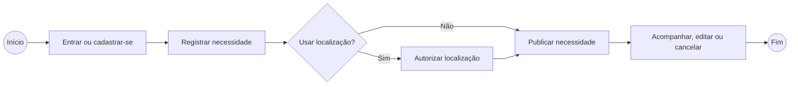
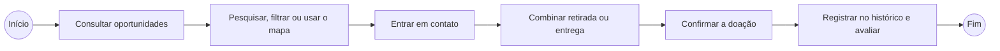
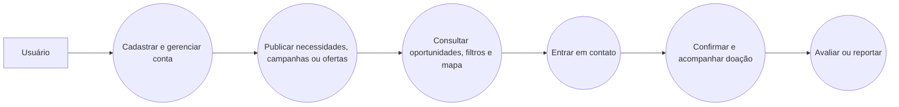

# Especificações do Projeto

Pré-requisitos: <a href="01-Documentação de Contexto.md"> Documentação de Contexto</a>

Esta especificação apresenta os perfis atendidos pelo Bem Próximo, as histórias de usuário, os processos de doação, os requisitos funcionais e não funcionais e as restrições conhecidas. O documento organiza as informações necessárias para compreender como o aplicativo móvel deverá apoiar doadores e donatários durante a divulgação, a busca e a realização de doações. A modelagem dos processos apresenta os principais fluxos de uso, enquanto as tabelas registram os requisitos que orientam a implementação. As informações foram organizadas a partir da documentação de contexto, da especificação, dos fluxos de interface e da metodologia do projeto. Dessa forma, o material serve como referência para o planejamento, o desenvolvimento e a validação do escopo do projeto.

## Personas

O projeto de origem define quatro perfis de usuários que representam pessoas físicas, empresas, organizações sociais e pessoas que necessitam de doações. Esses perfis ajudam a identificar quem poderá publicar, oferecer, buscar ou receber itens por meio do aplicativo. As necessidades de cada grupo orientam as funcionalidades de cadastro, publicação, pesquisa, contato e acompanhamento das doações. Como não foram fornecidos nomes, idades ou dados comportamentais individuais, os perfis são mantidos sem a criação de características fictícias. A tabela a seguir apresenta somente as informações que foram documentadas para cada tipo de participante.

| Perfil | Descrição | Necessidades |
|--------|-----------|-------------|
| Pessoa física doadora (CPF) | Cidadão que deseja realizar doações. | Ajudar pessoas necessitadas, destinar itens excedentes e, quando aplicável, buscar dedução no Imposto de Renda. |
| Empresa doadora (CNPJ) | Instituição com fins lucrativos interessada em ações de doação. | Ajudar quem precisa, realizar ações voluntárias, fortalecer a imagem pública e, quando aplicável, buscar dedução no Imposto de Renda. |
| ONG ou instituição religiosa (CNPJ) | Instituição sem fins lucrativos, organização governamental ou grupo religioso. | Apoiar pessoas necessitadas e fortalecer o bem-estar da comunidade. |
| Pessoa física donatária (CPF) | Cidadão em situação de necessidade ou vulnerabilidade. | Receber itens que contribuam para a melhoria de sua qualidade de vida. |

## Histórias de Usuários

| EU COMO... `PERSONA` | QUERO/PRECISO... `FUNCIONALIDADE` | PARA... `MOTIVO/VALOR` |
|----------------------|-----------------------------------|------------------------|
| Donatário — instituição religiosa (CNPJ) | Criar uma campanha de arrecadação de agasalhos, informando quais itens são necessários, quantidades, tamanhos aceitos, prazo da campanha e local ou forma de entrega. | Divulgar uma necessidade específica à comunidade, acompanhar o que já foi arrecadado e evitar receber itens em excesso ou que não atendam à campanha. |
| Donatário — ONG (CNPJ) | Cadastrar uma lista atualizada de itens necessários, indicando prioridade, quantidade e se a necessidade é pontual ou recorrente. | Permitir que potenciais doadores saibam exatamente do que a instituição precisa naquele momento e direcionem suas doações de forma mais eficiente. |
| Donatário — ONG ou instituição religiosa (CNPJ) | Disponibilizar para outras instituições itens recebidos em quantidade superior à minha necessidade. | Evitar que doações fiquem paradas ou sejam desperdiçadas e permitir que outra instituição que esteja precisando desses itens possa utilizá-los. |
| Doador (CPF) | Informar quais itens tenho disponíveis para doação e encontrar instituições próximas que estejam precisando especificamente desses itens. | Destinar objetos em bom estado para quem realmente necessita, sem precisar procurar individualmente instituições e entrar em contato com cada uma delas. |
| Doador (CNPJ) | Cadastrar lotes de produtos excedentes ou próximos da retirada de estoque e identificar instituições interessadas em recebê-los. | Evitar desperdício, liberar espaço de armazenamento e direcionar produtos utilizáveis para organizações que possam aproveitá-los. |
| Doador ou donatário | Poder entrar em contato com a outra parte interessada na doação. | Combinar informações necessárias para sua realização, como disponibilidade, retirada e entrega dos itens. |
| Doador ou donatário | Acompanhar minhas doações e solicitações e consultar as que já foram concluídas. | Saber a situação das negociações atuais e manter um registro das doações que realizei ou recebi. |
| Usuário do aplicativo | Reportar uma solicitação ou oferta que considere suspeita, inadequada ou irregular. | Contribuir para que conteúdos incompatíveis com a finalidade da plataforma sejam identificados e analisados. |

## Modelagem do Processo de Negócio 

### Análise da Situação Atual

As informações sobre necessidades e doações estão dispersas em redes sociais, páginas e grupos de mensagens. Esse cenário exige que o doador pesquise diferentes fontes para descobrir instituições, campanhas e pessoas que precisam de itens. Ao mesmo tempo, organizações e donatários possuem alcance limitado para divulgar demandas atualizadas para a comunidade. A fragmentação reduz a visibilidade das campanhas, torna mais demorado o contato entre as partes e dificulta a comparação entre oferta e necessidade. Sem um ponto central de consulta, itens que poderiam ser destinados a quem precisa podem permanecer parados ou não chegar ao público adequado.

### Descrição Geral da Proposta

O Bem Próximo será um aplicativo móvel para Android e iOS que conectará doadores e donatários em um único ambiente. Pelo aplicativo, os donatários poderão divulgar necessidades, campanhas e solicitações de itens, enquanto os doadores poderão registrar ofertas e localizar oportunidades compatíveis. A consulta poderá utilizar pesquisa, filtros, ordenação e visualização em mapa para facilitar a identificação de opções relevantes. Após encontrar uma oportunidade, os participantes poderão consultar os detalhes e entrar em contato para combinar a realização da doação. O acesso à localização dependerá da autorização do usuário, preservando o controle sobre os dados do aparelho.

### Processo 1 – Registro e divulgação de necessidades

No primeiro processo, o donatário entra no aplicativo ou realiza seu cadastro para acessar as funcionalidades disponíveis. Em seguida, registra uma necessidade com as informações necessárias para que a solicitação possa ser compreendida por potenciais doadores. O usuário pode decidir se deseja informar sua localização, pois esse dado depende de autorização explícita no dispositivo móvel. Depois do preenchimento, a necessidade é publicada para aparecer nas consultas realizadas pelo aplicativo. O responsável acompanha a situação da solicitação e pode editá-la ou cancelá-la quando as informações deixarem de ser válidas.

### Processo 2 – Localização e realização da doação

No segundo processo, o doador acessa o aplicativo para consultar solicitações, campanhas, ofertas ou instituições disponíveis. A busca pode ser refinada por pesquisa, filtros, ordenação e, quando houver autorização, pela visualização de opções no mapa. Após selecionar uma oportunidade, o usuário consulta os detalhes para verificar se a doação atende à necessidade apresentada. Em seguida, doador e donatário podem entrar em contato para combinar disponibilidade, retirada ou entrega dos itens. Ao final, a doação é confirmada, registrada no histórico e pode receber uma avaliação dos participantes.

## Indicadores de Desempenho

O repositório de origem não contém medições históricas sobre publicações, contatos ou doações concluídas. Por esse motivo, os indicadores abaixo são propostos para uma futura versão móvel com persistência centralizada. Eles permitem acompanhar se as necessidades estão sendo atendidas, se os usuários encontram oportunidades relevantes e se o contato entre as partes ocorre com agilidade. As métricas também ajudam a identificar o volume de itens destinados e a percepção dos participantes sobre a experiência. A coleta desses dados poderá apoiar decisões de melhoria e a avaliação do impacto social do aplicativo.

| Indicador | Cálculo | Finalidade |
|-----------|---------|------------|
| Taxa de necessidades atendidas | Doações concluídas ÷ necessidades encerradas × 100 | Avaliar a efetividade da plataforma |
| Tempo até o primeiro contato | Média entre publicação e primeira mensagem recebida | Medir a agilidade da conexão entre usuários |
| Volume de itens destinados | Soma das quantidades confirmadas como doadas | Acompanhar o impacto material das doações |
| Necessidades ativas | Quantidade de solicitações e campanhas abertas | Dimensionar a demanda disponível |
| Conversão de busca em contato | Contatos iniciados ÷ buscas realizadas × 100 | Avaliar a relevância dos filtros e resultados |
| Satisfação dos participantes | Média das notas de feedback | Acompanhar a percepção sobre a experiência |

Esses indicadores dependem de registros de datas, quantidades, estados, buscas, contatos e avaliações realizados pelos usuários. A futura implementação móvel precisará de um serviço de persistência capaz de sincronizar e consolidar essas informações entre os dispositivos. Os dados devem ser armazenados de forma consistente para que o cálculo dos indicadores represente corretamente a situação das solicitações e das doações. As informações reunidas poderão ser apresentadas em relatórios ou painéis de acompanhamento do projeto. Dessa maneira, a equipe terá uma base objetiva para avaliar resultados e priorizar melhorias futuras.

## Requisitos

As tabelas que se seguem apresentam os requisitos funcionais e não funcionais que detalham o escopo do projeto. Para determinar a prioridade de requisitos, aplicar uma técnica de priorização de requisitos e detalhar como a técnica foi aplicada.

### Requisitos Funcionais

| ID | Nome | Descrição | Prioridade |
|----|------|-----------|------------|
| RF-01 | Cadastro de usuários | O sistema deve permitir o cadastro de usuários, diferenciando doadores, donatários, ONGs e instituições religiosas. | Alta |
| RF-02 | Confirmação e autenticação | O sistema deve permitir confirmação de conta por e-mail e login com e-mail e senha. | Alta |
| RF-03 | Gerenciamento de conta | O sistema deve permitir que o usuário visualize, edite seus dados cadastrais, altere senha e solicite exclusão da conta. | Média |
| RF-04 | Registro de necessidades | O sistema deve permitir que o donatário cadastre itens necessários, informando descrição, categoria, quantidade, prioridade e recorrência. | Alta |
| RF-05 | Registro de itens disponíveis | O sistema deve permitir que o doador registre itens, produtos ou serviços disponíveis para doação, informando descrição, categoria e quantidade. | Alta |
| RF-06 | Campanhas de arrecadação | O sistema deve permitir que o donatário crie campanhas de arrecadação, informando título, descrição, período, itens necessários e forma de entrega. | Média |
| RF-07 | Edição e cancelamento | O sistema deve permitir que o responsável edite ou cancele solicitações, campanhas ou ofertas criadas por ele. | Média |
| RF-08 | Detalhes da solicitação ou oferta | O sistema deve exibir detalhes de solicitações, campanhas e ofertas, incluindo item, responsável, localização, quantidade e situação atual. | Alta |
| RF-09 | Visualização de doações | O sistema deve permitir visualizar solicitações, campanhas, ofertas e instituições disponíveis para doação. | Alta |
| RF-10 | Pesquisa, filtros e ordenação | O sistema deve permitir pesquisar, filtrar e ordenar solicitações/ofertas por palavra-chave, categoria, localização, prioridade e proximidade. | Média |
| RF-11 | Mapa e geolocalização | O sistema deve exibir solicitações, ofertas ou instituições em mapas com marcadores geográficos e permitir uso da localização atual do usuário. | Média |
| RF-12 | Comunicação entre usuários | O sistema deve permitir comunicação direta entre doadores e donatários por chat ou mensagem. | Média |
| RF-13 | Confirmação da doação | O sistema deve permitir confirmar a realização da doação e atualizar seu status para concluída. | Alta |
| RF-14 | Acompanhamento de status | O sistema deve permitir acompanhar a situação de solicitações, campanhas, ofertas e doações. | Alta |
| RF-15 | Histórico de doações | O sistema deve registrar e disponibilizar o histórico de doações realizadas e recebidas pelo usuário. | Média |
| RF-16 | Reporte de irregularidades | O sistema deve permitir reportar solicitações, campanhas ou ofertas suspeitas, inadequadas ou irregulares. | Média |
| RF-17 | Avaliações e feedbacks | O sistema deve permitir avaliações e feedbacks sobre doações ou instituições. | Baixa |

### Requisitos não Funcionais

| ID | Nome | Descrição | Prioridade |
|----|------|-----------|------------|
| RNF-01 | Responsividade | O sistema deve possuir interface responsiva, adaptando-se adequadamente a diferentes tamanhos de tela. | Alta |
| RNF-02 | Usabilidade | A interface deve permitir que os usuários realizem as principais operações de forma simples e compreensível, sem treinamento prévio. | Alta |
| RNF-03 | Consistência da interface | A interface deve manter consistência visual e de navegação entre as diferentes telas da aplicação. | Alta |
| RNF-04 | Acessibilidade | A interface deve seguir princípios básicos de acessibilidade, incluindo contraste adequado, campos identificados e botões compreensíveis. | Média |
| RNF-05 | Tratamento de erros | O sistema deve apresentar mensagens de erro claras quando uma operação não puder ser concluída. | Média |
| RNF-06 | Compatibilidade | A aplicação deve ser compatível, caso seja aplicativo móvel, com Android e iOS nas versões suportadas pelo projeto. | Alta |
| RNF-07 | Desempenho | Consultas, pesquisas, filtros e mapas devem possuir tempo de resposta adequado, sem comprometer a navegação. | Média |
| RNF-08 | Segurança das credenciais | O sistema deve proteger credenciais e dados pessoais, não armazenando senhas em texto simples. | Alta |
| RNF-09 | Controle de acesso | O sistema deve garantir que usuários somente alterem dados, solicitações e publicações para os quais possuam autorização. | Alta |
| RNF-10 | Privacidade e localização | O sistema deve tratar dados pessoais e de localização respeitando a privacidade e solicitando permissão antes de acessar a localização do usuário. | Alta |
| RNF-11 | Integridade dos dados | O sistema deve evitar registros inconsistentes ou alterações indevidas em usuários, solicitações, doações e status. | Alta |
| RNF-12 | Disponibilidade | O sistema deve permanecer disponível, exceto em manutenções programadas ou indisponibilidade de serviços externos. | Média |
| RNF-13 | Manutenibilidade | O código deve possuir organização modular e manutenível, facilitando correções, testes e evolução. | Média |
| RNF-14 | Consumo de APIs externas | O sistema pode consumir dados de APIs ou bases de ONGs de forma assíncrona e consistente, quando disponível. | Baixa |

## Restrições

O projeto está restrito pelos itens apresentados na tabela a seguir. Essas restrições definem limites para as decisões de tecnologia, interface e escopo funcional do Bem Próximo. A solução deve ser planejada como aplicativo móvel e considerar os sistemas operacionais indicados para o projeto. Além disso, o uso de localização depende do consentimento do usuário e da disponibilidade do recurso no dispositivo. O foco permanece na intermediação de doações de itens físicos, sem incluir pagamentos como parte do escopo principal.

| ID | Restrição |
|----|-----------|
| 01 | A solução deverá ser desenvolvida como aplicativo móvel. |
| 02 | O aplicativo deverá considerar Android e iOS nas versões suportadas pelo projeto. |
| 03 | O acesso à localização dependerá de autorização explícita do usuário e da disponibilidade do recurso no dispositivo. |
| 04 | O escopo principal está direcionado à doação de itens físicos, e não à intermediação de pagamentos. |

## Diagrama de Casos de Uso

O diagrama apresenta uma visão resumida das principais funcionalidades do aplicativo e organiza a interação do usuário em uma sequência simples. Ele inicia pelo acesso à conta, passa pela publicação e consulta de oportunidades e segue até o contato, a confirmação da doação e o registro de avaliações ou reportes. A representação foi mantida compacta para facilitar a leitura no documento e no repositório. As funcionalidades associadas à localização estão incluídas na consulta de oportunidades, pois são utilizadas de forma opcional. O detalhamento por tipo de usuário e requisito permanece na tabela de cobertura abaixo.

### Cobertura dos casos de uso

| Requisito | Caso de uso | Ator principal |
|-----------|-------------|----------------|
| RF-01 | Cadastrar conta | Usuário |
| RF-02 | Confirmar conta por e-mail e autenticar | Usuário |
| RF-03 | Gerenciar conta | Usuário |
| RF-04 | Registrar necessidade | Donatário |
| RF-05 | Registrar oferta | Doador |
| RF-06 | Criar campanha de arrecadação | Donatário |
| RF-07 | Editar ou cancelar publicação própria | Doador ou donatário |
| RF-08 | Consultar detalhes de solicitação ou oferta | Usuário |
| RF-09 | Visualizar solicitações, campanhas, ofertas e instituições | Usuário |
| RF-10 | Pesquisar, filtrar e ordenar | Usuário |
| RF-11 | Consultar mapa e proximidade | Usuário |
| RF-12 | Conversar por chat ou mensagem | Doador ou donatário |
| RF-13 | Confirmar doação e atualizar status | Doador ou donatário |
| RF-14 | Acompanhar status | Usuário |
| RF-15 | Consultar histórico | Usuário |
| RF-16 | Reportar irregularidade | Usuário |
| RF-17 | Avaliar doação ou instituição | Usuário |

A tabela detalha os casos resumidos no diagrama e mantém a correspondência com cada requisito funcional. Ela indica qual caso de uso atende cada requisito e qual ator é o principal responsável pela interação. A autorização de localização é solicitada quando o usuário opta por utilizar o mapa e a proximidade, conforme as condições de privacidade definidas para o aplicativo. Os demais requisitos não funcionais são condições de qualidade transversais que devem ser observadas em todas as telas e operações. Dessa forma, o diagrama continua simples, enquanto a tabela preserva a rastreabilidade necessária para o projeto.

# Matriz de Rastreabilidade

As histórias são identificadas pela ordem em que aparecem na tabela de Histórias de Usuário, sem alterar seu conteúdo original. A matriz relaciona cada história aos requisitos funcionais que contribuem para atender a necessidade apresentada pelo respectivo perfil. Essa relação facilita a conferência entre o que os usuários esperam do aplicativo e as funcionalidades registradas na especificação. Ela também pode ser utilizada durante o desenvolvimento para verificar se cada história possui cobertura suficiente nos requisitos. Os requisitos não funcionais são tratados como condições que se aplicam de forma geral a todas essas funcionalidades.

| História | Síntese | Requisitos relacionados |
|----------|---------|-------------------------|
| HU-01 | Campanha de arrecadação de agasalhos | RF-06, RF-07, RF-08 e RF-14 |
| HU-02 | Lista atualizada de necessidades | RF-04, RF-07, RF-08, RF-09 e RF-10 |
| HU-03 | Redistribuição de itens excedentes | RF-05, RF-08, RF-09, RF-12 e RF-13 |
| HU-04 | Oferta de itens por pessoa física | RF-05, RF-09, RF-10 e RF-11 |
| HU-05 | Oferta de lotes por empresa | RF-05, RF-09 e RF-10 |
| HU-06 | Contato entre as partes | RF-12 |
| HU-07 | Acompanhamento e histórico | RF-14 e RF-15 |
| HU-08 | Reporte de irregularidades | RF-16 |

Os requisitos não funcionais são transversais e se aplicam às interfaces e aos fluxos correspondentes. Eles definem condições de qualidade relacionadas à usabilidade, segurança, privacidade, desempenho, acessibilidade e manutenção do aplicativo. Diferentemente dos requisitos funcionais, esses itens não representam uma ação isolada do usuário, mas características que devem estar presentes em toda a solução. Por exemplo, a autorização para uso da localização e a proteção das credenciais devem ser consideradas nos recursos que utilizam esses dados. Assim, a implementação precisa observar esses requisitos durante todas as etapas de desenvolvimento e teste.

# Gerenciamento de Projeto

O projeto utiliza Scrum como base para organizar o desenvolvimento e acompanhar a evolução das entregas. Essa abordagem permite dividir o trabalho em ciclos curtos, revisar prioridades e registrar o andamento das tarefas de forma transparente. O código e os documentos são versionados no GitHub, facilitando o histórico de alterações e a colaboração entre os integrantes. As tarefas são acompanhadas no GitHub Projects, enquanto os protótipos das telas móveis são elaborados no Figma. O uso conjunto dessas ferramentas apoia a comunicação da equipe e a organização dos materiais do projeto.

## Gerenciamento de Tempo

O trabalho é organizado em sprints semanais para que a equipe possa definir prioridades e acompanhar entregas em períodos curtos. As atividades são registradas no GitHub Projects e percorrem um quadro Kanban que torna visível a situação de cada tarefa. Antes de iniciar uma sprint, as demandas mais relevantes são selecionadas a partir do backlog e organizadas para execução. Durante a semana, os integrantes atualizam o andamento das tarefas conforme o trabalho avança. Ao final do ciclo, as entregas concluídas podem ser revisadas e novas necessidades podem ser incluídas no planejamento.

- **Backlog:** reúne o Product Backlog e novas atividades identificadas durante o projeto;
- **To Do:** representa o Sprint Backlog da semana;
- **Doing:** contém as tarefas em desenvolvimento;
- **Done:** reúne as tarefas testadas, revisadas e prontas para entrega.

As tarefas também são classificadas pelas categorias Bug, Desenvolvimento, Documentação, Gerência de Projetos, Infraestrutura e Testes. Essa classificação facilita a identificação do tipo de trabalho necessário e ajuda a distribuir as atividades entre os integrantes. Itens de desenvolvimento representam funcionalidades e melhorias do aplicativo, enquanto itens de testes apoiam a validação do comportamento esperado. As tarefas de documentação e gerência mantêm os registros do projeto atualizados e organizados. Já as categorias de bug e infraestrutura permitem acompanhar correções e necessidades relacionadas ao ambiente técnico.

## Gerenciamento de Equipe

Os integrantes e papéis informados para o projeto são apresentados na tabela a seguir. Anna Rodrigues e Helena Bretas atuam como Scrum Masters, apoiando a organização do trabalho e o acompanhamento das atividades da equipe. Os membros de desenvolvimento participam da construção e evolução das funcionalidades previstas para o aplicativo. A equipe de design contribui para a definição e o aperfeiçoamento das telas e da experiência de uso em dispositivos móveis. A mesma composição foi informada para as equipes de desenvolvimento e design, permitindo colaboração entre as atividades técnicas e de interface.

| Papel | Responsáveis |
|-------|--------------|
| Scrum Masters | Anna Rodrigues; Helena Bretas |
| Equipe de Desenvolvimento | Anna Rodrigues; Arthur Vieira; Diego Alencar; Helena Bretas; Rodrigo Galvão; Vitor Fernandes |
| Equipe de Design | Anna Rodrigues; Arthur Vieira; Diego Alencar; Helena Bretas; Rodrigo Galvão; Vitor Fernandes |

## Gestão de Orçamento

O repositório de origem não informa orçamento, custos de equipe, serviços de backend ou despesas de distribuição do aplicativo. Por isso, não há valores financeiros documentados para registrar nesta especificação. O planejamento utiliza ferramentas com acesso gratuito adequadas ao escopo acadêmico, como GitHub para versionamento e Figma para elaboração de protótipos. Caso o projeto evolua para uma versão publicada, será necessário estimar custos de infraestrutura, serviços externos, manutenção e distribuição nas lojas de aplicativos. Até que essas definições sejam fornecidas, a gestão de orçamento permanece limitada às informações disponíveis no repositório.
