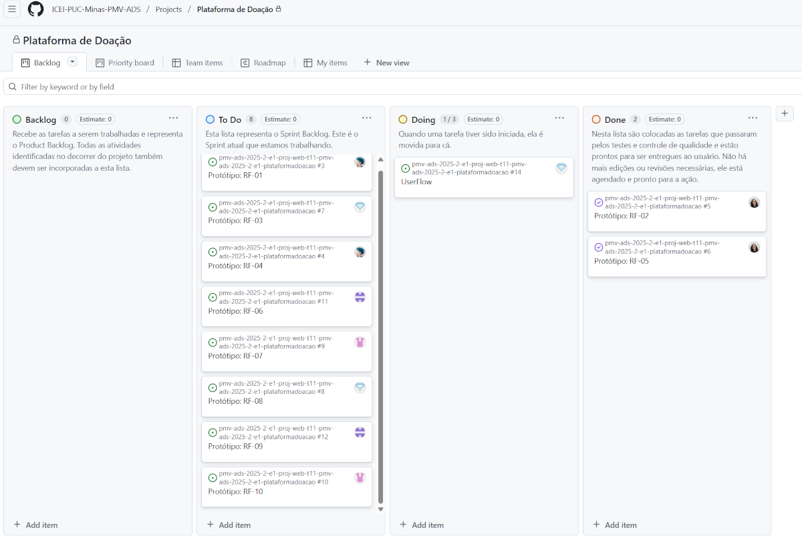

# Metodologia

Pré-requisitos: <a href="02-Especificação do Projeto.md"> Documentação de Especificação</a>

O projeto utiliza Scrum como referência para organizar o trabalho da equipe. O desenvolvimento é dividido em sprints semanais, com tarefas registradas no GitHub Projects e distribuídas em um quadro Kanban.

## Relação de Ambientes de Trabalho

| Ambiente | Plataforma | Link de acesso |
|----------|------------|----------------|
| Repositório de código e documentos | GitHub | [Repositório do projeto](https://github.com/diergu/MovApplicationProject-Template) |
| Projeto de interface | Figma | [Projeto da equipe](https://www.figma.com/files/team/1552103386582326863/project/457235706/Projeto-de-equipe?fuid=1552080773447498305) |
| Gerenciamento de tarefas | GitHub Projects | [Quadro do projeto de origem](https://github.com/orgs/ICEI-PUC-Minas-PMV-ADS/projects/2466/views/1) |
| Hospedagem da aplicação de origem | GitHub Pages | [Bem Próximo](https://icei-puc-minas-pmv-ads.github.io/pmv-ads-2025-2-e1-proj-web-t11-pmv-ads-2025-2-e1-plataformadoacao/src/) |

## Controle de Versão

O código e a documentação são controlados com [Git](https://git-scm.com/) e hospedados no GitHub. A branch `main` representa a versão integrada do projeto. Commits registram as alterações realizadas e o GitHub Projects mantém a rastreabilidade entre tarefas de desenvolvimento, documentação, infraestrutura, testes e correções.

As tarefas são classificadas com as seguintes categorias:

- Bug;
- Desenvolvimento;
- Documentação;
- Gerência de Projetos;
- Infraestrutura;
- Testes.

## Gerenciamento de Projeto

### Divisão de Papéis

| Papel | Responsáveis |
|-------|--------------|
| Scrum Master | Helena Bretas |
| Product Owner | Johnata de Souza do Amparo |
| Equipe de Desenvolvimento | Elizabeth França Vaz dos Santos; Geovana Vitória Andrade Silva; Gildney Chaves Neto; Helena Bretas; Johnata de Souza do Amparo |
| Equipe de Design | Elizabeth França Vaz dos Santos; Geovana Vitória Andrade Silva; Gildney Chaves Neto |

### Processo

As sprints possuem duração semanal. O fluxo das tarefas no GitHub Projects é organizado da seguinte forma:

- **Backlog:** reúne o Product Backlog e novas atividades identificadas;
- **To Do:** contém o Sprint Backlog da semana;
- **Doing:** recebe as tarefas em desenvolvimento;
- **Done:** contém tarefas testadas, revisadas e prontas para entrega.

### Ferramentas

| Ferramenta | Finalidade |
|------------|------------|
| Git e GitHub | Versionamento e colaboração no código e na documentação |
| GitHub Projects | Planejamento das sprints e acompanhamento do Kanban |
| GitHub Pages | Hospedagem da aplicação estática |
| Figma | Criação e validação dos protótipos de interface |
| HTML, CSS e JavaScript | Implementação da aplicação web front-end |
