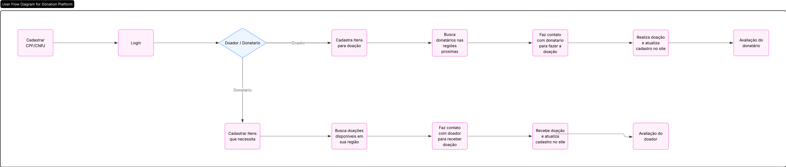
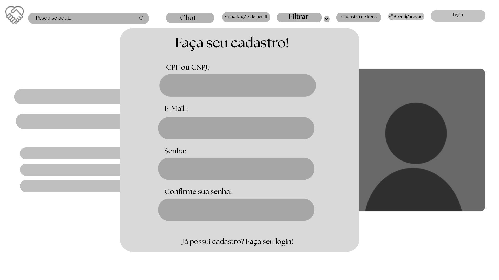
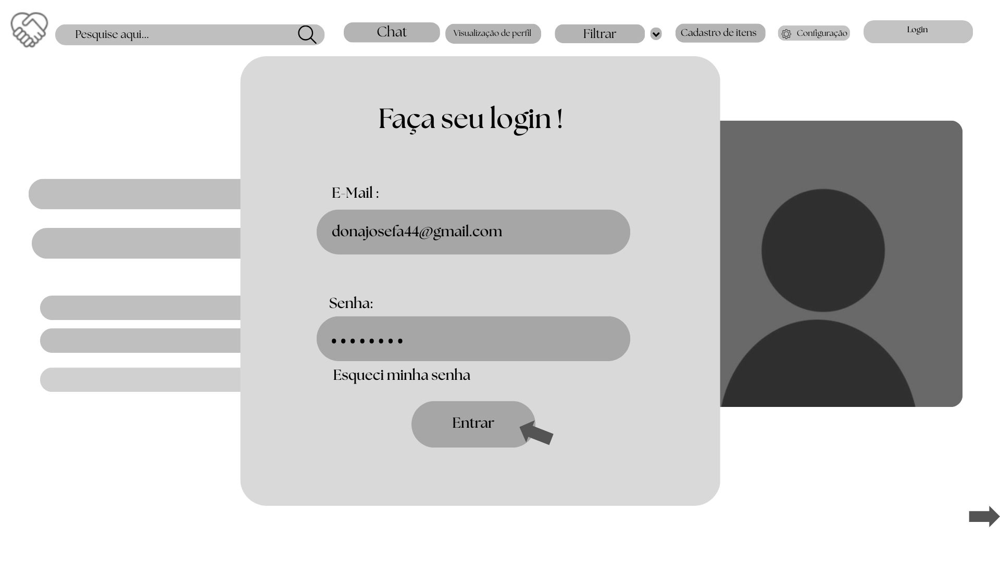
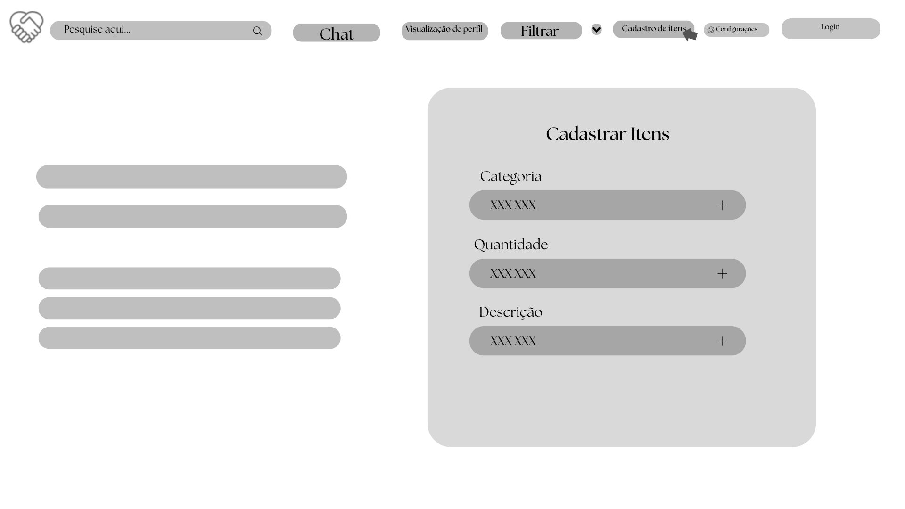
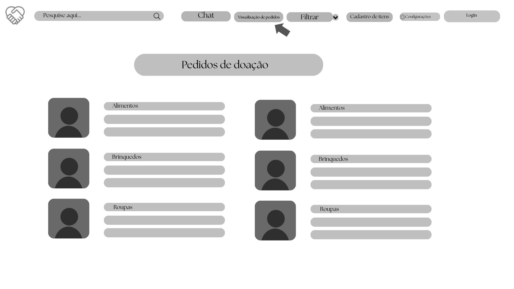
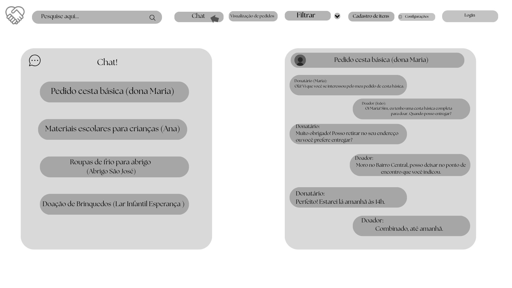
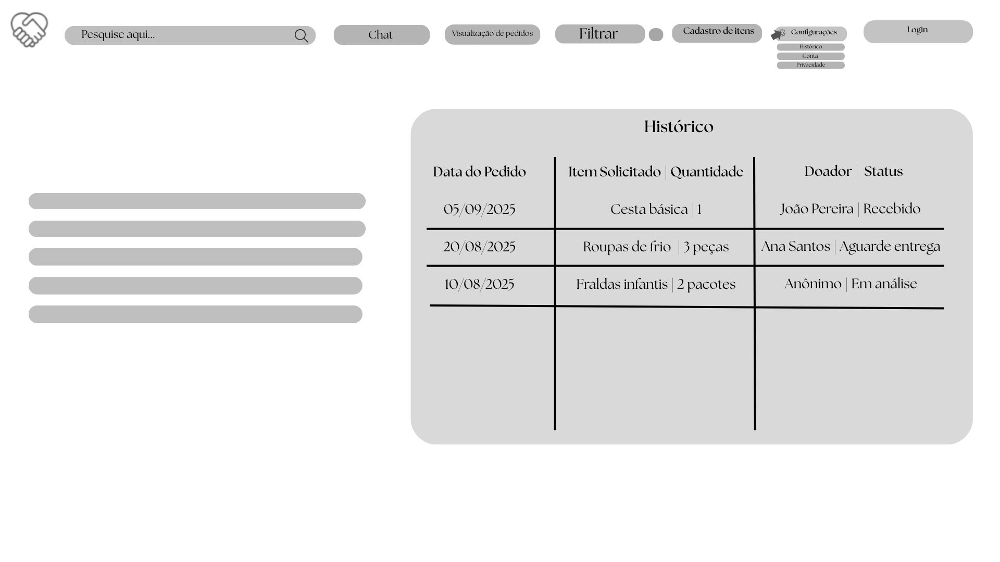
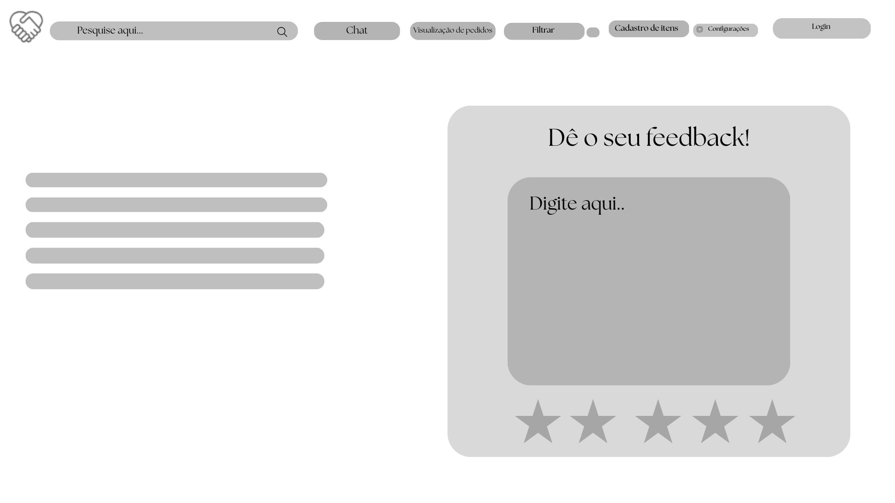
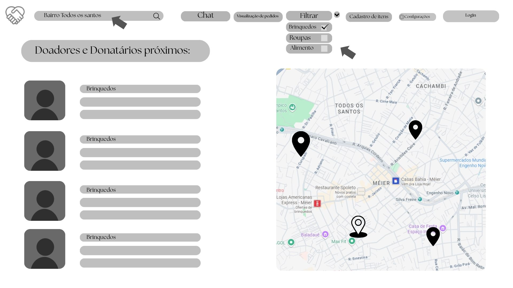
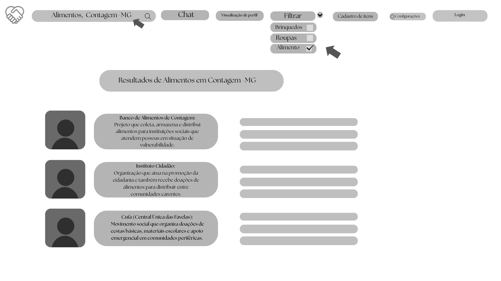

# Projeto de Interface

Pré-requisitos: <a href="02-Especificação do Projeto.md"> Documentação de Especificação</a>

A interface do Bem Próximo foi planejada para permitir que doadores e donatários realizem as principais tarefas com navegação simples. O projeto contempla cadastro e login, registro e consulta de itens, pedidos de doação, busca por localização, chat, histórico e feedback.

## Diagrama de Fluxo

O fluxo de usuário apresenta os caminhos de navegação entre as principais áreas da aplicação e ajuda a relacionar as telas aos requisitos e histórias de usuário.

## Wireframes

Os protótipos de baixa fidelidade foram utilizados para validar a organização das telas antes da implementação.

### Cadastro de doador e donatário

### Login

### Registro de itens

### Pedidos de doação

### Chat

### Histórico

### Feedback

### Busca local e filtros

### Locais de doação

