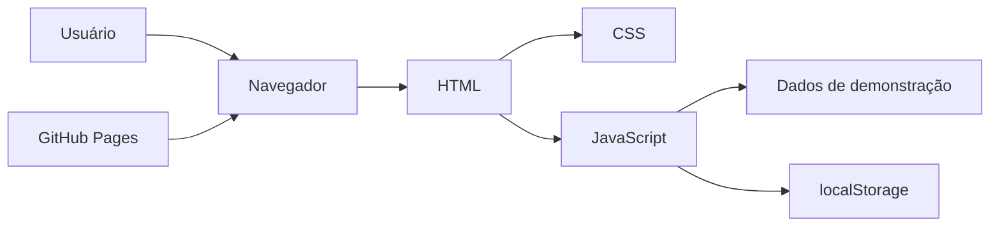
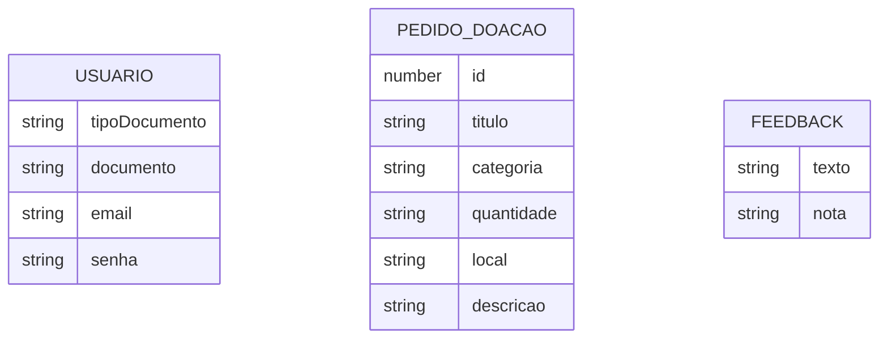

# Arquitetura da Solução

Pré-requisitos: <a href="04-Projeto de Interface.md"> Projeto de Interface</a>

O Bem Próximo é um protótipo web estático executado inteiramente no navegador. Os documentos HTML estruturam as telas, as folhas CSS definem a identidade visual e a responsividade, e os módulos JavaScript controlam navegação, filtros, formulários e dados de demonstração.

Não há backend, API própria ou banco de dados no código fornecido. O estado persistente do protótipo é armazenado no `localStorage` do navegador.

## Diagrama de Classes

A implementação não utiliza classes JavaScript nem um modelo orientado a objetos formal. O comportamento está dividido por módulos de tela, como cadastro, pedidos de doação, busca de locais, chat, histórico e feedback.

| Módulo | Responsabilidade |
|--------|------------------|
| `Pagina-Cadastro/paginaCadasto.js` | Cadastro, validação de CPF/CNPJ e login local |
| `Pagina-Itenscadastro/itens.js` | Registro e exibição de pedidos de doação |
| `Pagina-Doacoes/doacoes.js` | Renderização dos pedidos disponíveis |
| `Pagina-Locais/pagina-Locais.js` | Busca e filtragem por cidade, bairro, tipo e item |
| `Pagina-Chat/paginaChat.js` | Simulação da troca de mensagens |
| `Pagina-feedback/feedback.js` | Registro e listagem de avaliações |

## Modelo ER

Como não existe banco de dados, não há Modelo Entidade-Relacionamento persistente. Os dados locais possuem as seguintes estruturas lógicas:

## Esquema Relacional

Não se aplica à versão atual, pois o protótipo não utiliza um banco de dados relacional. Os registros são serializados em JSON e armazenados pelas chaves `usuarios`, `usuarioLogado`, `pedidosDoacao` e `feedbacks` no `localStorage`.

## Modelo Físico

Não existe arquivo `banco.sql` ou camada de persistência no repositório de origem. A adoção de backend e banco de dados exigirá uma etapa posterior de projeto e migração dos dados locais.

## Tecnologias Utilizadas

| Tecnologia | Uso no projeto |
|------------|----------------|
| HTML5 | Estrutura semântica das páginas e formulários |
| CSS3 | Layout, cores, componentes e responsividade |
| JavaScript | Navegação, validações, filtros, renderização dinâmica e persistência local |
| Web Storage API | Armazenamento local de usuários, sessão, pedidos e feedbacks |
| Google Fonts | Fontes Poppins, Inter, Montserrat e Playfair Display |
| Git e GitHub | Versionamento e colaboração |
| GitHub Pages | Hospedagem do site estático |
| Figma | Prototipação das interfaces |

## Hospedagem

A aplicação de origem está publicada como site estático no GitHub Pages: [Bem Próximo](https://icei-puc-minas-pmv-ads.github.io/pmv-ads-2025-2-e1-proj-web-t11-pmv-ads-2025-2-e1-plataformadoacao/src/).

Para uma nova publicação, o diretório `src` deve ser servido por um servidor HTTP estático ou configurado como origem de uma página do GitHub Pages.

## Qualidade de Software

As características de qualidade priorizadas na especificação são responsividade, usabilidade, consistência da interface, acessibilidade, tratamento de erros, compatibilidade, desempenho, segurança, privacidade, integridade, disponibilidade e manutenibilidade.

| Característica | Evidência ou métrica proposta |
|----------------|-------------------------------|
| Usabilidade | Taxa de conclusão das tarefas e necessidade de assistência |
| Compatibilidade | Execução dos casos de teste nos navegadores definidos pelo projeto |
| Responsividade | Ausência de rolagem horizontal e preservação dos fluxos em diferentes larguras |
| Desempenho | Tempo de resposta percebido nas buscas, filtros e troca de telas |
| Acessibilidade | Contraste, identificação de campos, textos alternativos e operação por teclado |
| Segurança | Ausência de credenciais em texto simples e controle de acesso aos dados |

> **Limitação conhecida:** o protótipo de origem armazena senhas em texto simples no `localStorage`. Esse comportamento não atende ao RNF-08 e deverá ser substituído por autenticação segura em uma evolução com backend.
